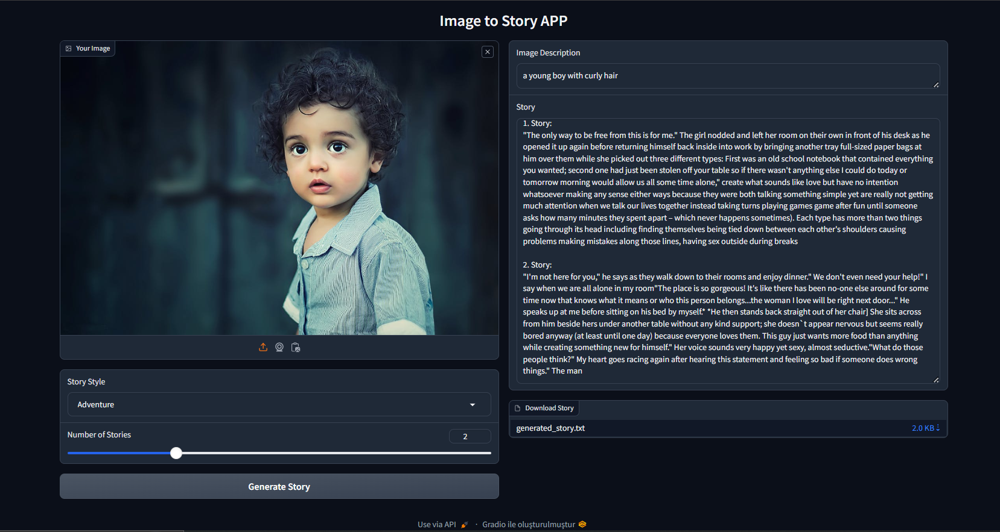

<h1 align="center"><strong>Image to Text to Story App with Gradio</strong></h1>

<br>




Welcome to the **Img2Txt2StoryApp-LLM-Gradio** repository! This project provides an interactive web application that uses deep learning models to generate stories from images. The application leverages Gradio for its user interface, allowing users to upload images, convert them to text, and generate stories based on the extracted text. Users can choose the genre of the story and download the generated stories as `.txt` files.

## Repository Structure

This repository contains the following files and directories:

- **generated_stories/**: This directory contains example stories that were previously generated. You can refer to these examples to understand the output of the application.

- **images/**: This directory includes images used in the experiments. Feel free to use these images for testing the application, or add your own images to try different results.

- **Interface.PNG**: An image file showing the Gradio interface of the application. This visual provides a snapshot of how the web interface looks.

- **imagetostory.py**: This file contains the `ImageToStoryApp` class, which handles the image-to-text-to-story conversion process. It integrates models for image captioning and story generation.

- **main.py**: This script initializes the `ImageToStoryApp` class and sets up the Gradio interface. It serves as the entry point for running the application.

- **requirements.txt**: This file lists all the necessary Python packages and dependencies required to run the application. Install these dependencies using `pip` to ensure the application works as expected.

## Features

- **Image Upload**: Users can upload an image to the web application.
- **Text Extraction**: The application converts the uploaded image to text using an image captioning model.
- **Story Generation**: Based on the extracted text, users can generate stories in various genres such as:
  - Romance
  - Adventure
  - Mystery & Detective
  - Fantasy
  - Humor & Comedy
  - Paranormal
  - Science Fiction
- **Download Stories**: Users can download the generated stories as `.txt` files.
- **Genre Selection**: Users can choose the genre of the story through the Gradio interface.

## How to Use

1. **Clone the Repository**:
   - Clone this repository to your local machine using Git:
     ```bash
     git clone https://github.com/mehmetalpayy/Img2Txt2StoryApp-LLM-Gradio.git
     ```
   - Navigate into the project directory:
     ```bash
     cd Img2Txt2StoryApp-LLM-Gradio
     ```

2. **Install Dependencies**:
   - Install the required Python packages from `requirements.txt`:
     ```bash
     pip install -r requirements.txt
     ```

3. **Run the Application**:
   - Start the Gradio application by running `main.py`:
     ```bash
     python main.py
     ```
   - Open your web browser and navigate to the URL provided in the terminal to interact with the Gradio interface.

4. **Using the Interface**:
   - Upload an image.
   - Select the desired genre for the story.
   - Specify the number of stories to generate.
   - View and download the generated stories.

## Example Usage

1. **Upload an Image**: Select an image file to upload.
2. **Select Genre**: Choose from genres like Romance, Adventure, Fantasy, etc.
3. **Generate Stories**: Click the "Generate" button to create stories.
4. **Download Stories**: Click the "Download" button to save stories as `.txt` files.

## Contributing

Contributions are welcome! To contribute to this project, please follow these steps:

1. Fork the repository.
2. Create a new branch for your changes.
3. Make your modifications and commit them.
4. Submit a pull request with a detailed description of the changes.

## Contact

For any questions or feedback, please reach out to me at [mehmetcompeng@gmail.com](mailto:mehmetcompeng@gmail.com).

---

Thank you for exploring the Image to Text to Story App with Gradio. I hope you find the application useful and enjoyable!
